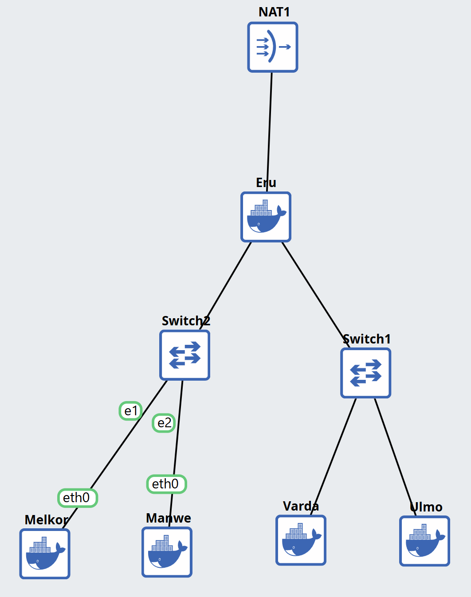
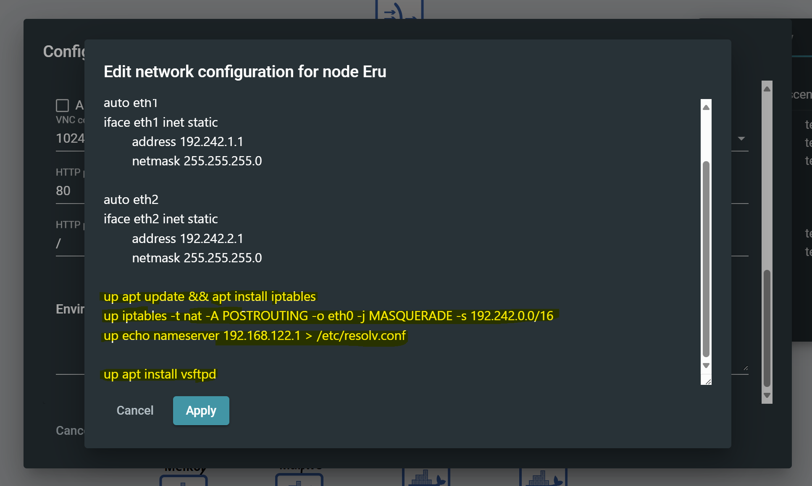
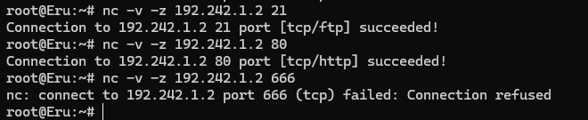
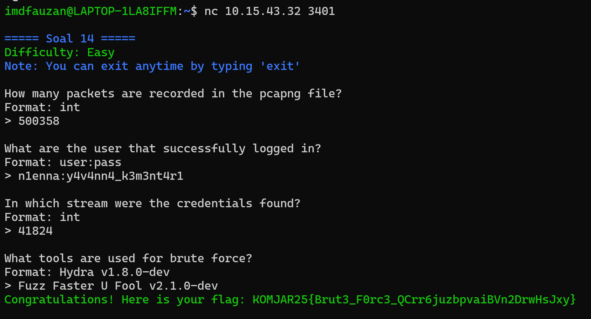
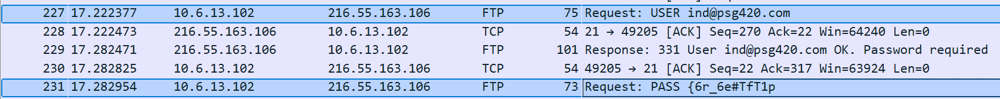

# Modul 1
## Praktikum Komunikasi Data & Jaringan Komputer

## Anggota Kelompok 
| Nama    | NRP  |
|---------|------|
| Imam Mahmud Dalil Fauzan  | 5027241100  |
| Zaenal Mustofa | 50272410  |

## Soal Praktikum
<b>IP Address Host : 10.15.43.32 (Gunakan Jaringan/VPN ITS)</b>

<b>The Ainulindalë</b>
1. Untuk mempersiapkan pembuatan entitas selain mereka, Eru yang berperan sebagai Router membuat dua Switch/Gateway. Dimana Switch 1 akan menuju ke dua Ainur yaitu Melkor dan Manwe. Sedangkan Switch 2 akan menuju ke dua Ainur lainnya yaitu Varda dan Ulmo. Keempat Ainur tersebut diberi perintah oleh Eru untuk menjadi Client.
2. Karena menurut Eru pada saat itu Arda (Bumi) masih terisolasi dengan dunia luar, maka buat agar Eru dapat tersambung ke internet.
3. Sekarang pastikan agar setiap Ainur (Client) dapat terhubung satu sama lain.
4. Setelah berhasil terhubung, sekarang Eru ingin agar setiap Ainur (Client) dapat mandiri. Oleh karena itu pastikan agar setiap Client dapat tersambung ke internet.
5. Ainur terkuat Melkor tetap berusaha untuk menanamkan kejahatan ke dalam Arda (Bumi). Sebelum terjadi kerusakan, Eru dan para Ainur lainnya meminta agar semua konfigurasi tidak hilang saat semua node di restart.
6. Setelah semua Ainur terhubung ke internet, Melkor mencoba menyusup ke dalam komunikasi antara Manwe dan Eru. Jalankan file berikut [(link file)](https://drive.google.com/drive/folders/1ULr_Fik1O0_79zUng41POMZtdzJTugVR?usp=sharing) lalu lakukan packet sniffing menggunakan Wireshark pada koneksi antara Manwe dan Eru, lalu terapkan display filter untuk menampilkan semua paket yang berasal dari atau menuju ke IP Address Manwe. Simpan hasil capture tersebut sebagai bukti.
7. Untuk meningkatkan keamanan, Eru memutuskan untuk membuat sebuah FTP Server di node miliknya. Lakukan konfigurasi FTP Server pada node Eru. Buat dua user baru: ainur dengan hak akses write&read dan melkor tanpa hak akses sama sekali ke direktori shared. Buktikan hasil tersebut dengan membuat file teks sederhana kemudian akses file tersebut menggunakan kedua user.
8. Ulmo, sebagai penjaga perairan, perlu mengirimkan data ramalan cuaca ke node Eru. Lakukan koneksi sebagai client dari node Ulmo ke FTP Server Eru menggunakan user ainur. Upload sebuah file berikut [(link file)](https://drive.google.com/drive/folders/1XQh6S1xXcaP1QoUhQSZORsgK9xdMUxXx?usp=sharing). Analisis proses ini menggunakan Wireshark dan identifikasi perintah FTP yang digunakan untuk proses upload.
9. Eru ingin membagikan "Kitab Penciptaan" di [(link file)](https://drive.google.com/drive/folders/1K1pf8Y1wh_y1f6b57VRtjs3hdkeQUao5?usp=sharing) kepada Manwe. Dari FTP Server Eru, download file tersebut ke node Manwe. Karena Eru merasa Kitab tersebut sangat penting maka ia mengubah akses user ainur menjadi read-only. Gunakan Wireshark untuk memonitor koneksi, identifikasi perintah FTP yang digunakan, dan uji akses user ainur.
10. Melkor yang marah karena tidak diberi akses, mencoba melakukan serangan dengan mengirimkan banyak sekali request ke server Eru. Gunakan command ping dari node Melkor ke node Eru dengan jumlah paket yang tidak biasa (spam ping misalnya 100 paket). Amati hasilnya, apakah ada packet loss? Catat average round trip time untuk melihat apakah serangan tersebut mempengaruhi kinerja Eru.
11. Sebelum era koneksi aman, Eru sering menyelinap masuk ke wilayah Melkor. Eru perlu masuk ke node tersebut untuk memeriksa konfigurasi, namun ia tahu Melkor mungkin sedang memantau jaringan. Buktikan kelemahan protokol Telnet dengan membuat akun dan password baru di node Melkor kemudian menangkap sesi login Eru ke node Melkor menggunakan Wireshark. Tunjukkan bagaimana username dan password dapat terlihat sebagai plain text.
12. Eru mencurigai Melkor menjalankan beberapa layanan terlarang di node-nya. Lakukan pemindaian port sederhana dari node Eru ke node Melkor menggunakan Netcat (nc) untuk memeriksa port 21, 80, dalam keadaan terbuka dan port rahasia 666 dalam keadaan tertutup.
13. Setelah insiden penyadapan Telnet, Eru memerintahkan semua koneksi administratif harus menggunakan SSH (Secure Shell) untuk mengamankan jaringan. Lakukan koneksi SSH dari node Varda ke Eru. Tangkap sesi tersebut menggunakan Wireshark. Analisis dan jelaskan mengapa username dan password tidak dapat dilihat seperti pada sesi Telnet. Tunjukkan paket-paket terenkripsi dalam hasil capture sebagai bukti keamanan SSH.

<b> ⚠️Peringatan Beberapa Soal Dibawah Mengandung Malware Asli ⚠️</b>

14. Setelah gagal mengakses FTP, Melkor melancarkan serangan brute force terhadap  Manwe. Analisis file capture yang disediakan dan identifikasi upaya brute force Melkor.
[(link file)](https://drive.google.com/drive/folders/13rf0AlzUrkNhUWbBNt9tIVSimw3njKqd?usp=sharing) `nc 10.15.43.32 3401`.
15. Melkor menyusup ke ruang server dan memasang keyboard USB berbahaya pada node Manwe. Buka file capture dan identifikasi pesan atau ketikan (keystrokes) yang berhasil dicuri oleh Melkor untuk menemukan password rahasia.
[(link file)](https://drive.google.com/drive/folders/1aHSRMoEgQBsA-4I2wWatFxAy3laumcgb?usp=sharing) nc 10.15.43.32 3402
16. Melkor semakin murka ia meletakkan file berbahaya di server milik Manwe. Dari file capture yang ada, identifikasi file apa yang diletakkan oleh Melkor. [(link file)](https://drive.google.com/drive/folders/1aJf_PQGXwr4fxd79df8nd7NzL7SsN6U9?usp=sharing) `nc 10.15.43.32 3403`.
17. Manwe membuat halaman web di node-nya yang menampilkan gambar cincin agung. Melkor yang melihat web tersebut merasa iri sehingga ia meletakkan file berbahaya agar web tersebut dapat dianggap menyebarkan malware oleh Eru. Analisis file capture untuk menggagalkan rencana Melkor dan menyelamatkan web Manwe.
[(link file)](https://drive.google.com/drive/folders/10UNx8BhvbyCDhHGHS7D7zmyvFbCf41ze?usp=sharing) `nc 10.15.43.32 3404`.
18. Karena rencana Melkor yang terus gagal, ia akhirnya berhenti sejenak untuk berpikir. Pada saat berpikir ia akhirnya memutuskan untuk membuat rencana jahat lainnya dengan meletakkan file berbahaya lagi tetapi dengan metode yang berbeda. Gagalkan lagi rencana Melkor dengan mengidentifikasi file capture yang disediakan agar dunia tetap aman.
[(link file)](https://drive.google.com/drive/folders/1R4-D1WnsDVrT73UlkacjY0Ntag42AFUy?usp=sharing) nc 10.15.43.32 3405
19. Manwe mengirimkan email berisi surat cinta kepada Varda melalui koneksi yang tidak terenkripsi. Melihat hal itu Melkor sipaling jahat langsung melancarkan aksinya yaitu meneror Varda dengan email yang disamarkan. Analisis file capture jaringan dan gagalkan lagi rencana busuk Melkor.
	[(link file)](https://drive.google.com/drive/folders/1D6d8EYdIvE8UF_i4Ms0C7Yakd9j0GYBN?usp=sharing) `nc 10.15.43.32 3406`.
20. Untuk yang terakhir kalinya, rencana besar Melkor yaitu menanamkan sebuah file berbahaya kemudian menyembunyikannya agar tidak terlihat oleh Eru. Tetapi Manwe yang sudah merasakan adanya niat jahat dari Melkor, ia menyisipkan bantuan untuk mengungkapkan rencana Melkor. Analisis file capture dan identifikasi kegunaan bantuan yang diberikan oleh Manwe untuk menggagalkan rencana jahat Melkor selamanya.
[(link file)](https://drive.google.com/drive/folders/1wOe76_DgH087tAaHH_jxsHCinwFv9pmT?usp=sharing) `nc 10.15.43.32 3407`.
</ol>

## Write Up
1. Buka alamat ip 10.15.43.32 di Browser, dan Open Project File kelompok K-62. Buat topologi seperti gambar dibawah ini.
   
2. Sambungkan Eru lewat Terminal Linux, lalu ketikkan:
    -  `iptables -t nat -A POSTROUTING -o eth0 -j MASQUERADE -s [Prefix IP].0.0/16`
    -  `cat /etc/resolv.conf`
    -  `echo nameserver 192.168.122.1 > /etc/resolv.conf`
3. Untuk Membuktikan bahwa Eru sudah terhubung ke internet, ketikkan `ping google.com`.
4. Agar setiap Client bisa terhubung Internet luar, ketikkan: `echo nameserver 192.168.122.1 > /etc/resolv.conf` pada setiap Client. Untuk membuktikan setiap Client sudah terhubung ke Internet, ketikkan `ping google.com` pada setiap Client.
5. Agar konfigurasi tidak hilang saat node di restart, ketikkan perintah apa saja yang ingin dilakukan saat device diboot dengan diawali `up`, kemudian ditaruh di Configure pada tiap device.<br> Perhatikan gambar berikut:
    
6. Untuk menyelesaikan nomor 6, ikuti langkah berikut:
    - Buka Project tersebut lewat <b>aplikasi GNS3</b>.
    - Klik kanan pada garis yang menghubungkan <b>Eru dan Switch 2</b>, lalu pilih <b>Start Capture. Akan otomatis terbuka Wireshark (Install Wireshark jika belum).</b>
    - Download file [traffic.sh](src/traffic.sh), kemudian copy semua isi dari file `traffic.sh`.
    - Sambungkan terminal Linux ke Client <b>Manwe</b>.
    - Buat file baru didalam Manwe cara `nano traffic.sh`, lalu paste isi dari file `traffic.sh` (step 3) yang sudah dicopy tadi.
    - Simpan file tersebut dengan cara menekan `CTRL + X`, lalu tekan `Y`, kemudian tekan `ENTER`.
    - Beri izin eksekusi pada file tersebut dengan cara `chmod +x traffic.sh`.
    - Jalankan file tersebut dengan cara `./traffic.sh`.
    - Setelah itu, kembali ke aplikasi Wireshark, lalu pada bagian <b>Display Filter</b> ketikkan `ip.addr == <IP Manwe>`, Enter.
    - Simpan hasil capture tersebut dengan cara klik <b>File &gt; Save As</b>, lalu beri nama file tersebut `soal6.pcapng`.
7. Untuk menyelesaikan nomor 7, ikuti langkah berikut:
    - Sambungkan terminal Linux ke Client <b>Eru</b>.
    - Install vsftpd dengan cara `apt-get install vsftpd`.
    - Setelah itu, buka file konfigurasinya dengan cara `nano /etc/vsftpd.conf`.
    - Tambahkan kode ini di paling bawah file tersebut:
      ```
        local_enable=YES
        write_enable=YES
        anonymous_enable=NO
        chroot_local_user=YES
        userlist_enable=YES
        userlist_file=/etc/vsftpd.userlist
        userlist_deny=YES
      ```
    - Simpan file tersebut dengan cara menekan `CTRL + X`, lalu tekan `Y`, kemudian `ENTER`.
    - Restart service vsftpd dengan cara `service vsftpd restart`.
    - Buat direktori baru untuk FTP dengan cara `mkdir -p ~/ftp/shared`.
    - Ubah kepemilikan direktori tersebut dengan cara `chown nobody:nogroup ~/ftp` dan `chmod a-w ~/ftp`.
    - Buat user baru bernama `ainur` dengan cara `adduser ainur`, lalu masukkan password sesuai keinginan.
    - Buat direktori home untuk user ainur dengan cara `mkdir -p /home/ainur/ftp/shared`.
    - Ubah kepemilikan direktori tersebut dengan cara `chown ainur:ainur /home/ainur/ftp/shared`.
    - Buat user baru bernama `melkor` dengan cara `adduser melkor`, lalu masukkan password sesuai keinginan.
    - Buat direktori home untuk user melkor dengan cara `mkdir -p /home/melkor/ftp/shared`.
    - Ubah kepemilikan direktori tersebut dengan cara `chown melkor:melkor /home/melkor/ftp/shared`.
    - Ubah hak akses direktori shared milik melkor agar tidak bisa diakses sama sekali dengan cara `chmod 000 /home/melkor/ftp/shared`.
    - Sekarang, untuk membuktikan user ainur bisa mengakses direktori shared, sambungkan terminal Linux ke Client <b>Ulmo</b>.
    - Install ftp client dengan cara `apt-get install ftp`.
    - Setelah itu, sambungkan ke FTP Server Eru dengan cara `ftp <IP Eru>`, lalu masukkan username dan password sesuai user.
    - Setelah berhasil masuk, pindah ke direktori shared dengan cara `cd shared`.
    - Buat file teks sederhana dengan cara `echo "Ini adalah file dari ainur" > file_ainur.txt`.
    - Setelah itu, ketikkan `ls` untuk melihat isi direktori shared, disana terlihat file `file_ainur.txt`.
    - Sekarang, untuk membuktikan user melkor tidak bisa mengakses direktori shared, sambungkan terminal Linux ke Client <b>Melkor</b>.
    - Install ftp client dengan cara `apt-get install ftp`.
    - Setelah itu, sambungkan ke FTP Server Eru dengan cara `ftp <IP Eru>`, lalu masukkan username dan password sesuai user.
    - Setelah berhasil masuk, pindah ke direktori shared dengan cara `cd shared`.
    - Ketikkan `ls` untuk melihat isi direktori shared, disana tidak terlihat isi dari direktori shared.
8. 
9. 
10. Buka Terminal Melkor, lalu ketikkan `ping <IP Eru> -c 100`, akan muncul proses ping hingga 100 kali. Catat hasil akhirnya.
11. Membuktikan bahwa protokol Telnet mengirimkan nama pengguna dan kata sandi dalam bentuk teks biasa (plaintext).  
	1.  **Konfigurasi Node Melkor:**
	    -   Instal layanan Telnet (`apt-get install inetutils-telnetd`).
	    -   Aktifkan layanan di `/etc/inetd.conf`.
	    -   Buat pengguna baru (`useradd -m eru_test` dan `passwd eru_test`).
	2.  **Konfigurasi Node Eru:**
	    -   Instal klien Telnet (`apt-get install telnet`).
		-   Mulai *capture* Wireshark pada tautan antara Eru dan Melkor.
		-   Jalankan `telnet 192.242.1.2` dari konsol Eru.
		-   Masukkan nama pengguna `eru_test` dan kata sandi saat diminta.
	
	## Analisis Bukti
	[Lihat Hasil pcap](src/soal11.pcapng)
	
	- Setelah sesi, filter lalu lintas dengan `telnet`.
	- Temukan paket yang dikirim dari Eru ke Melkor.
	- Pada paket ini, nama pengguna dan kata sandi terlihat jelas di bagian **Telnet Data** sebagai teks biasa. 
12. Memeriksa port 21, 80, dalam keadaan terbuka dan port rahasia 666 dalam keadaan tertutup dengan menggunakan Netcat(nc).
	-  Konfigurasi di Node Eru  
	   Pada konsol Eru, pastikan utilitas Netcat terinstal.
	   ```
	   # Perbarui daftar paket
		apt-get update

		# Instal Netcat
		apt-get install netcat-openbsd
       ```
	-  Konfigurasi di Node Melkor  
	   Pada konsol Melkor, pastikan layanan untuk port 21 dan 80 sudah terinstal dan berjalan.
    	```
		# Instal dan mulai layanan FTP (vsftpd) untuk port 21
		apt-get install vsftpd
		service vsftpd start

		# Instal dan mulai layanan web (apache2) untuk port 80
		apt-get install apache2
		service apache2 start
		```
     -  Proses Pemindaian Port
		```
		# Perintah
		nc -v -z 192.242.1.2 21
		nc -v -z 192.242.1.2 80
		nc -v -z 192.242.1.2 666
		```
     -  Hasilnya port 21 dan 80 tertutup, port rahasia 666 terbuka.  
	    .
13.  Bagian ini adalah untuk menunjukkan bagaimana SSH mengenkripsi kredensial untuk mengamankan komunikasi.  
	 - Pada node Eru, layanan SSH server (openssh-server) diinstal dan dikonfigurasi untuk mengizinkan login root.  
	    
	 - Pada node Varda, klien SSH (openssh-client) diinstal.  
	 - Penangkapan paket Wireshark dimulai pada tautan antara Varda dan Eru.
	 - Koneksi SSH dilakukan dari Varda ke Eru, dan kredensial login dimasukkan.
	   .
	 Berikut File pcap nya :  
	 [jawaban-no-13](src/no13.pcapng)
14. 	   
15. 
16. 
17. Buka command yang diberikan `nc 10.15.43.32 3401`, berisi 4 soal:
    - Jawaban Soal 1: `500358`
    <br> - Buka file pcap yang diberikan dengan Wireshark, Lihat jumlah baris yang ada di bar bawah.
    - Jawaban Soal 2: `n1enna:y4v4nn4_k3m3nt4r1`
    <br> - Cek satu-satu setiap tcp.stream, cari user yang successfully logged in.
    - Jawaban Soal 3: `41824`
    <br> - Cari manual di tcp.stream tersebut.
    - Jawaban Soal 4: `Fuzz Faster U Fool v2.1.0-dev`
    <br> - Analisis format pada credential tersebut.
    Setelah menjawab 4 soal tersebut, saya mendapat flag `Congratulations! Here is your flag: KOMJAR25{Brut3_F0rc3_QCrr6juzbpvaiBVn2DrwHsJxy}`.
    .
18. Buka command yang diberikan `nc 10.15.43.32 3402` :
    - Jawaban Soal 1: `Keyboard`
    <br> - Analisis paket pertama dan kedua, ditemukan:
        ```
        idvendor: SiGma Micro (0x1c4f)
        idproduct: Unknown (0x0084)
        ```
        Dan diperkuat dengan bukti paket 16 yang berisi:
        ```
        bstring: USB Keyboard
        ```
    - Jawaban Soal 2: 
19. Buka command yang diberikan `nc 10.15.43.32 3403`, :
    - Jawaban Soal 1: `ind@psg420.com:{6r_6e#TfT1p`
    <br> - Buka file pcap yang diberikan, periksa FTP Protocol dan periksa info di tiap paket. Ditemukan user dan pass pada FTP Protocol bagian bawah. 
    - Jawaban Soal 2: `5`
    <br> - Ditemukan 5 jenis file: `t.exe`, `r.exe`, `e.exe`, `w.exe`, `q.exe`.


